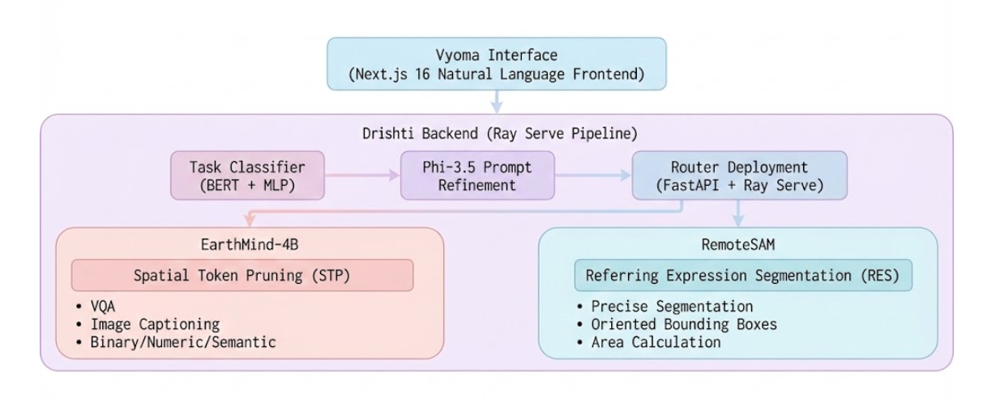

# DRISHTI — Deep Remote-sensing Intelligence System for Holistic Task Integration

<p align="center">
  <b>A Scalable Remote Sensing Vision-Language Model for Unified Spatial Reasoning</b>
</p>

---

<p align="center">
  🥈 <b>Awarded Silver Medal at Inter IIT Tech Meet 14.0</b>
</p>

---



DRISHTI is a state-of-the-art Remote Sensing Vision-Language Model (RS-VLM) that unifies image-, region-, and pixel-level tasks for satellite and aerial imagery analysis. It addresses the challenges of ultra-high-resolution imagery's token explosion and heterogeneous modalities (optical/SAR), enabling unified spatial reasoning across diverse remote sensing applications.

## Key Features

| Component | Description |
|-----------|-------------|
| **DRISHTI** | Unified RS-VLM integrating optical and SAR understanding at image, region, and pixel levels |
| **STP (Spatial Token Pruning)** | Single-pass token pruning that preserves multiple salient regions while reducing visual compute by up to **50%** |
| **EarthMind-4B** | Structured Visual Question Answering (VQA) and image captioning for remote sensing imagery |
| **RemoteSAM** | Deterministic pixel reasoning for precise segmentation and oriented bounding box localization |
| **Vyoma Interface** | Natural language interface supporting grounded exploration of large RS scenes |
| **Task Classifier** | BERT-based automatic query routing to the appropriate model (caption/vqa/grounding/area) |

## Technical Highlights

### Spatial Token Pruning (STP)
Unlike iterative zooming approaches, STP is a **single-pass method** that:
- Analyzes attention patterns across transformer layers (layers 19-29)
- Generates gradient-weighted attention maps to identify salient regions
- Dynamically selects relevant image tiles based on query context
- Reduces visual compute by up to **50%** while preserving task-critical information
- Supports ultra-high-resolution imagery through intelligent tile selection

### Multi-Task Support
DRISHTI handles diverse remote sensing tasks through unified inference:
- **Caption**: Generate descriptive captions for satellite imagery
- **VQA**: Answer visual questions with binary, numeric, or semantic responses
- **Grounding**: Locate objects with precise segmentation masks and oriented bounding boxes
- **Area Calculation**: Compute geographic areas from segmentation masks

## Quick Start

### Prerequisites

- Docker and Docker Compose
- NVIDIA GPU with CUDA support
- NVIDIA Container Toolkit (`nvidia-container-toolkit`)
- Ensure that docker is configured to use NVIDIA runtime by doing `sudo nvidia-ctk runtime configure --runtime=docker && sudo systemctl restart docker`
- At least 16GB GPU VRAM (recommended: 24GB+)
- ~20GB disk space for model weights

### One-Command Deployment

```bash
# Clone the repository
git clone https://github.com/4adex/drishti.git
cd drishti

# IMPORTANT: Change the server ip in env if deploying in a remote machine
# Run the setup script
./setup.sh
```

This will:
1. Download model weights (~15GB) from Hugging Face
2. Build Docker images for backend and frontend
3. Start all services

### Access the Application

Once running:
- **Frontend**: http://localhost:3000
- **Backend API**: http://localhost:8000
- **API Documentation**: http://localhost:8000/docs

## Deployment Options

### Detached Mode (Background)

```bash
# Start in background
./setup.sh -d

# View logs
./setup.sh --logs

# Stop services
./setup.sh --down
```

### Skip Downloads (If weights already exist)

```bash
./setup.sh --skip-weights
```

### Custom Configuration

```bash
# Copy and edit environment file
cp .env.example .env

# Configure ports, GPU, etc.
nano .env

# Then run setup
./setup.sh
```

### Environment Variables

| Variable | Default | Description |
|----------|---------|-------------|
| `MODELS_DIR` | `./backend/models` | Path to model weights |
| `BACKEND_PORT` | `8000` | Backend API port |
| `FRONTEND_PORT` | `3000` | Frontend web port |
| `CUDA_VISIBLE_DEVICES` | `0` | GPU device(s) to use |
| `NEXT_PUBLIC_API_URL` | `http://localhost:8000` | Backend URL for frontend |

### Setting Up for Remote Access

When deploying on a remote server, you **must** configure `NEXT_PUBLIC_API_URL` to point to your server's public IP or domain. Otherwise, the frontend will try to connect to `localhost` which won't work from external clients.

1. **Create or edit the `.env` file:**

```bash
cp .env.example .env
nano .env
```

2. **Set your server's public IP:**

```env
# Drishti Configuration
BACKEND_PORT=8000
FRONTEND_PORT=3000
CUDA_VISIBLE_DEVICES=0

# IMPORTANT: Replace with your server's public IP or domain
NEXT_PUBLIC_API_URL=http://YOUR_SERVER_IP:8000

# Models directory
MODELS_DIR=./backend/models
```

3. **Rebuild the frontend** (required because `NEXT_PUBLIC_*` vars are baked in at build time):

```bash
# If already running, rebuild frontend with new config
docker compose build frontend --no-cache
docker compose up -d

# Or for fresh deployment
./setup.sh
```

> **Note**: Any time you change `NEXT_PUBLIC_API_URL`, you must rebuild the frontend for the changes to take effect.


## Development

### Backend Only

```bash
cd backend
./setup.sh
```

### Frontend Only

```bash
cd frontend
pnpm install
pnpm dev
```

### Manual Docker Compose

```bash
# Build images
docker compose build

# Start services
docker compose up

# Or in detached mode
docker compose up -d
```

## Troubleshooting

### GPU Not Detected

```bash
# Check NVIDIA Docker runtime
docker info | grep nvidia

# Install nvidia-container-toolkit if missing
sudo apt-get install nvidia-container-toolkit
sudo systemctl restart docker
```

### Out of Memory

Reduce GPU usage by modifying `backend/serve.py` or use a single model at a time. The system requires:
- **Minimum**: 16GB GPU VRAM
- **Recommended**: 24GB+ for optimal performance with STP enabled

### Backend Health Check Failing

The backend takes 2-3 minutes to load models (EarthMind-4B ~8GB, RemoteSAM, BERT classifier). Wait for the health check to pass:

```bash
# Check backend status
curl http://localhost:8000/health
```

### Port Already in Use

```bash
# Use different ports
BACKEND_PORT=8001 FRONTEND_PORT=3001 ./setup.sh
```

## API Endpoints

| Endpoint | Method | Description |
|----------|--------|-------------|
| `/health` | GET | Health check for all model deployments |
| `/predict` | POST | Unified inference endpoint (auto-routes via Task Classifier) |
| `/geoNLI/eval` | POST | GeoNLI evaluation endpoint for benchmarking |
| `/docs` | GET | Interactive API documentation (Swagger UI) |


## Acknowledgments

- [EarthMind](https://huggingface.co/sy1998/EarthMind-4B) — Vision-Language Model for remote sensing
- [RemoteSAM](https://huggingface.co/1e12Leon/RemoteSAM) — Segment Anything for Earth Observation (ACM MM 2025)
- [Ray Serve](https://docs.ray.io/en/latest/serve/) — Scalable model serving framework
- [Next.js](https://nextjs.org/) — React framework for the Vyoma interface

