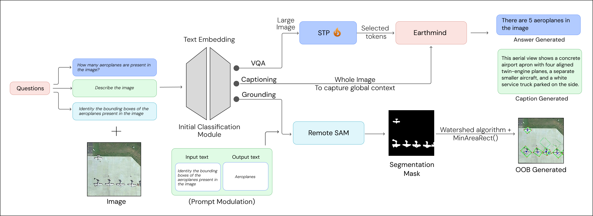

# DRISHTI Backend

> **DRISHTI** — *Deep Remote-sensing Intelligence System for Holistic Task Integration*

An industry state-of-the-art pipeline for remote sensing, providing a production-ready inference backend for geospatial AI models. This backend deploys **EarthMind**, **RemoteSAM**, a **Query Classifier**, and **Phi-3.5** for prompt modulation. Built on **Ray Serve** for efficient deployment with minimal overhead and batch inference support.



## Overview

This backend provides a unified API for:
- **EarthMind-4B**: Visual Question Answering (VQA) and image captioning for remote sensing imagery
- **RemoteSAM**: Referring segmentation and grounding for geospatial objects
- **Task Classifier**: Automatic routing of queries to the appropriate model (caption/vqa/grounding/area)
- **Phi-3.5**: Prompt refinement and modulation for improved RemoteSAM performance

## Project Structure

```
├── serve.py                    # Main entry point for Ray Serve deployment
├── requirements.txt            # Python dependencies
├── Dockerfile                  # Docker image definition
├── docker-compose.yml          # Docker Compose configuration
├── setup.sh                    # Automated setup script (Docker deployment)
├── deployments/
│   ├── earthmind_deployment.py # EarthMind model deployment
│   ├── remotesam_deployment.py # RemoteSAM model deployment
│   ├── classifier_deployment.py# Task classifier deployment
│   ├── phi_deployment.py       # Phi-3.5 prompt refinement deployment
│   └── router_deployment.py    # FastAPI router and request handling
├── utils_pkg/
│   ├── token_pruning.py        # Token pruning utilities for efficiency
│   └── utils.py                # Shared utilities (mask conversion, bbox extraction)
└── models/
    ├── EarthMind-4B/           # EarthMind model weights
    ├── RemoteSAM/              # RemoteSAM model and weights
    └── Task_Classifier/        # Query classifier weights
```

## Deployment

### Option 1: Docker (Recommended)

The easiest way to deploy is using the provided `setup.sh` script which handles everything:

```bash
# Make the script executable
chmod +x setup.sh

# Run setup (builds image, downloads weights, starts server)
./setup.sh
```

The script will:
1. Build the Docker image
2. Download EarthMind-4B and RemoteSAM weights from HuggingFace
3. Start the server container with GPU support

**Environment Variables** (optional):
```bash
MODELS_DIR=/path/to/models    # Custom models directory
HOST_PORT=8000                # Host port to expose
CONTAINER_PORT=8000           # Container internal port
IMAGE_NAME=earthmind-server   # Custom image name
```

**Using Docker Compose**:
```bash
docker-compose up --build
```

### Option 2: Local Installation (Without Docker)

1. **Create a virtual environment**:

   Using `python3`:
   ```bash
   python3 -m venv venv
   source venv/bin/activate
   ```

   Using `conda`:
   ```bash
   conda create -n earthmind python=3.10
   conda activate earthmind
   ```

   Using `uv`:
   ```bash
   uv venv
   source .venv/bin/activate
   ```

2. **Install dependencies**:
   ```bash
   pip install -r requirements.txt
   pip install bitsandbytes
   ```

3. **Download model weights** (if not already present):
   ```bash
   # EarthMind-4B weights
   mkdir -p ./models/EarthMind-4B
   wget -O ./models/EarthMind-4B/model-00001-of-00004.safetensors \
     https://huggingface.co/sy1998/EarthMind-4B/resolve/main/model-00001-of-00004.safetensors
   wget -O ./models/EarthMind-4B/model-00002-of-00004.safetensors \
     https://huggingface.co/sy1998/EarthMind-4B/resolve/main/model-00002-of-00004.safetensors
   wget -O ./models/EarthMind-4B/model-00003-of-00004.safetensors \
     https://huggingface.co/sy1998/EarthMind-4B/resolve/main/model-00003-of-00004.safetensors
   wget -O ./models/EarthMind-4B/model-00004-of-00004.safetensors \
     https://huggingface.co/sy1998/EarthMind-4B/resolve/main/model-00004-of-00004.safetensors

   # RemoteSAM weights
   mkdir -p ./models/RemoteSAM/pretrained_weights
   wget -O ./models/RemoteSAM/pretrained_weights/RemoteSAMv1.pth \
     https://huggingface.co/1e12Leon/RemoteSAM/resolve/main/RemoteSAMv1.pth
   ```

4. **Start the server**:
   ```bash
   python3 serve.py
   ```

## Command Line Arguments

| Argument | Default | Description |
|----------|---------|-------------|
| `--earthmind_path` | `./models/EarthMind-4B` | Path to EarthMind model |
| `--remotesam_path` | `./models/RemoteSAM/pretrained_weights/RemoteSAMv1.pth` | Path to RemoteSAM checkpoint |
| `--classifier_path` | `./models/Task_Classifier` | Path to task classifier model |
| `--phi_model` | `microsoft/Phi-3.5-mini-instruct` | Phi-3.5 model ID for prompt refinement |
| `--host` | `0.0.0.0` | Server host address |
| `--port` | `8000` | Server port |
| `--load_8bit` | `false` | Load EarthMind in 8-bit mode for reduced memory |
| `--dtype` | `float16` | Model precision (`auto`, `float16`, `bfloat16`, `float32`) |
| `--no_ray_init` | `false` | Skip Ray initialization if already initialized |
| `--ray_temp_dir` | `None` | Custom directory for Ray temporary files |

## API Endpoints

### `POST /predict`
Main prediction endpoint with automatic task classification and model routing.

### `POST /geoNLI/eval`
Batch evaluation endpoint supporting multiple query types:
- `caption_query`: Image captioning
- `grounding_query`: Object grounding/segmentation
- `attribute_query.binary`: Yes/No questions
- `attribute_query.numeric`: Numeric value extraction (including area calculation)
- `attribute_query.semantic`: Semantic attribute extraction

## Architecture

The deployment uses Ray Serve to manage multiple model deployments with automatic scaling:

| Deployment | Description | GPU Usage |
|------------|-------------|-----------|
| **EarthMindDeployment** | VQA and captioning with token pruning | 0.4-1.0 GPU |
| **RemoteSAMDeployment** | Grounding and segmentation | 0.3-1.0 GPU |
| **PhiDeployment** | Prompt refinement for RemoteSAM | 0.3-1.0 GPU |
| **TaskClassifierDeployment** | Query classification | CPU only |
| **RouterDeployment** | Request routing and API handling | CPU only |

### GPU Allocation Strategy
- **3+ GPUs**: Each model gets 1.0 GPU
- **2 GPUs**: EarthMind gets 1.0, RemoteSAM and Phi share 0.5 each
- **1 GPU**: All models share (EarthMind: 0.4, RemoteSAM: 0.3, Phi: 0.3)
- **No GPU**: CPU-only mode

## Why Ray Serve?

- **Efficient Resource Sharing**: Multiple models share GPU resources with minimal overhead
- **Batch Inference**: Automatic request batching for improved throughput
- **Horizontal Scaling**: Easy scaling with `num_replicas` configuration
- **Native FastAPI Integration**: Seamless REST API with async support
- **Production Ready**: Built-in health checks, logging, and monitoring
